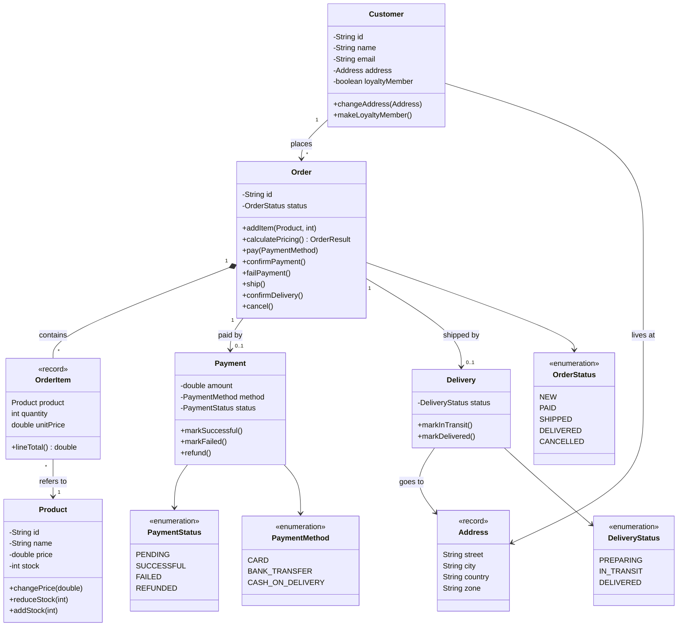

# UML class diagram

```mermaid
classDiagram
    class Customer {
        -String id
        -String name
        -String email
        -Address address
        -boolean loyaltyMember
        +changeAddress(Address)
        +makeLoyaltyMember()
    }
    class Product {
        -String id
        -String name
        -double price
        -int stock
        +changePrice(double)
        +reduceStock(int)
        +addStock(int)
    }
    class Order {
        -String id
        -OrderStatus status
        +addItem(Product, int)
        +calculatePricing() OrderResult
        +pay(PaymentMethod)
        +confirmPayment()
        +failPayment()
        +ship()
        +confirmDelivery()
        +cancel()
    }
    class Payment {
        -double amount
        -PaymentMethod method
        -PaymentStatus status
        +markSuccessful()
        +markFailed()
        +refund()
    }
    class Delivery {
        -DeliveryStatus status
        +markInTransit()
        +markDelivered()
    }
    class OrderItem {
        <<record>>
        Product product
        int quantity
        double unitPrice
        +lineTotal() double
    }
    class Address {
        <<record>>
        String street
        String city
        String country
        String zone
    }
    class OrderStatus {
        <<enumeration>>
        NEW
        PAID
        SHIPPED
        DELIVERED
        CANCELLED
    }
    class PaymentStatus {
        <<enumeration>>
        PENDING
        SUCCESSFUL
        FAILED
        REFUNDED
    }
    class PaymentMethod {
        <<enumeration>>
        CARD
        BANK_TRANSFER
        CASH_ON_DELIVERY
    }
    class DeliveryStatus {
        <<enumeration>>
        PREPARING
        IN_TRANSIT
        DELIVERED
    }

    Customer "1" --> "*" Order : places
    Customer --> Address : lives at
    Order "1" *-- "*" OrderItem : contains
    OrderItem "*" --> "1" Product : refers to
    Order "1" --> "0..1" Payment : paid by
    Order "1" --> "0..1" Delivery : shipped by
    Delivery --> Address : goes to
    Order --> OrderStatus
    Payment --> PaymentStatus
    Payment --> PaymentMethod
    Delivery --> DeliveryStatus
```