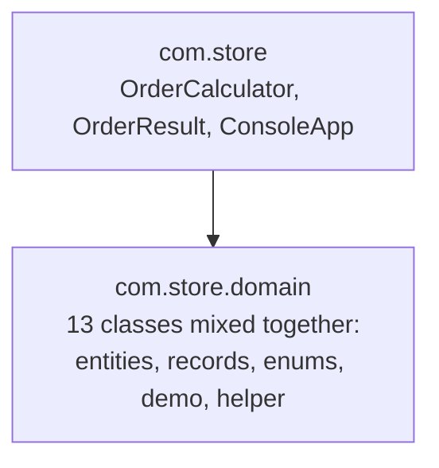
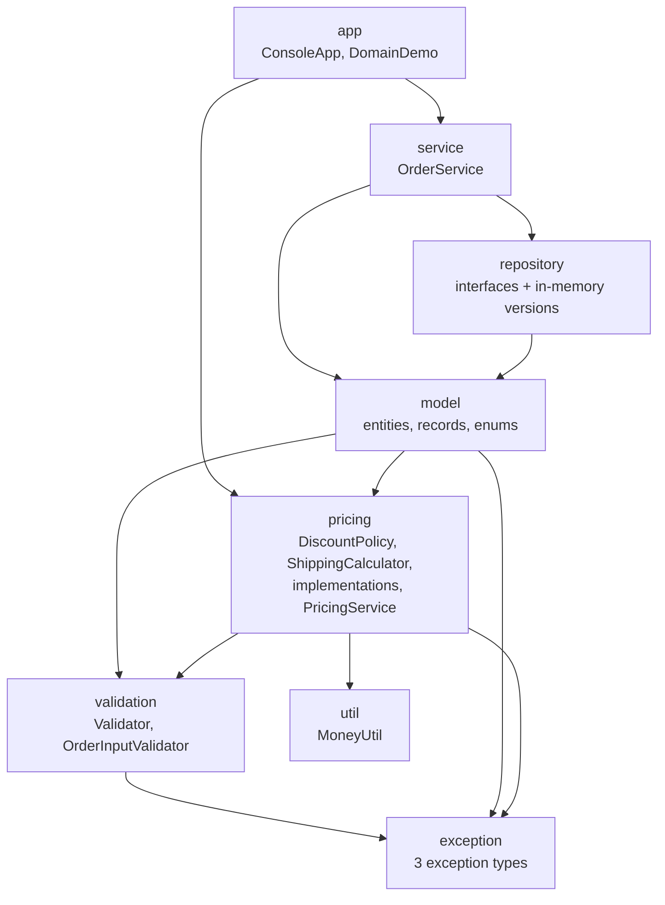

# Package diagram: before and after

## Before (Week 2)

```mermaid
flowchart TD
    A["com.store<br/>OrderCalculator, OrderResult, ConsoleApp"]
    B["com.store.domain<br/>13 classes mixed together:<br/>entities, records, enums, demo, helper"]
    A --> B
```

## After (Week 3)

An arrow means "uses". Nothing points back up the chain.

```mermaid
flowchart TD
    app["app<br/>ConsoleApp, DomainDemo"]
    service["service<br/>OrderService"]
    repository["repository<br/>interfaces + in-memory versions"]
    model["model<br/>entities, records, enums"]
    pricing["pricing<br/>DiscountPolicy, ShippingCalculator,<br/>implementations, PricingService"]
    validation["validation<br/>Validator, OrderInputValidator"]
    exception["exception<br/>3 exception types"]
    util["util<br/>MoneyUtil"]

    app --> service
    app --> pricing
    service --> repository
    service --> model
    repository --> model
    model --> pricing
    model --> validation
    pricing --> validation
    pricing --> util
    validation --> exception
    model --> exception
    pricing --> exception
```